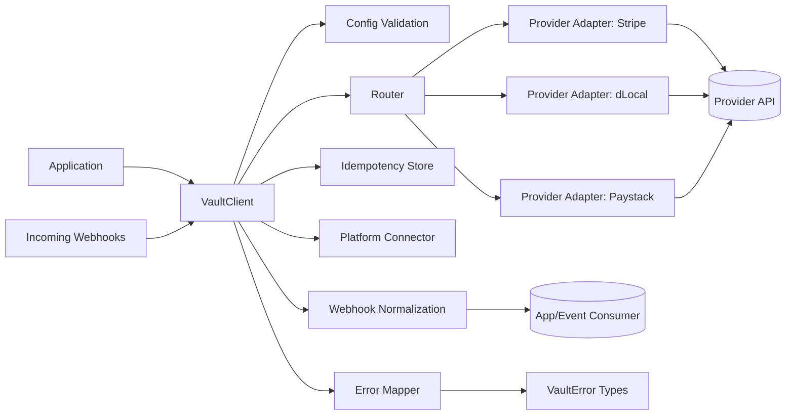

# Architecture Overview

`@vaultsaas/core` normalizes provider adapters behind a single orchestration client.

## Core Components

- `VaultClient`: entry point for charge/auth/capture/refund/void/status/webhooks.
- `Router`: evaluates routing rules and provider capabilities.
- `Adapters`: implement provider-specific API calls and webhook verification.
- `Error Mapper`: normalizes provider/network failures into canonical `VaultError` codes.
- `Idempotency`: prevents duplicate operation execution for repeated keys.
- `Platform Connector`: optional telemetry and remote routing integration.
